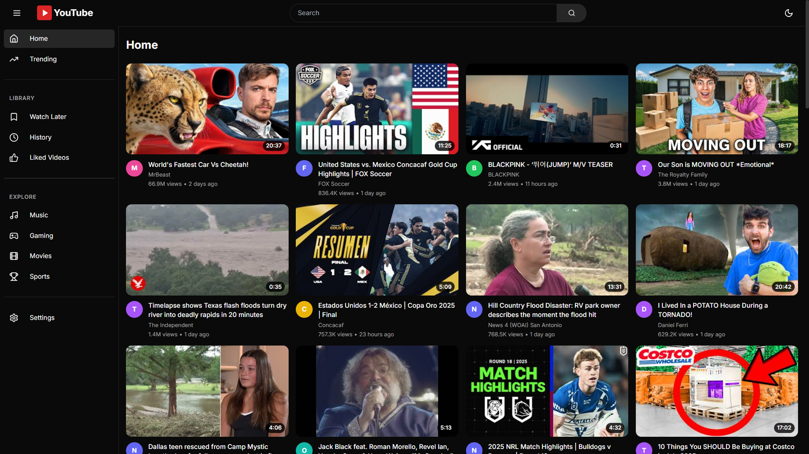

# 🎬 YouTube Clone

<div align="center">



**A modern, fully-featured YouTube clone built with cutting-edge technologies**

[](https://nextjs.org/)
[](https://www.typescriptlang.org/)
[](https://tailwindcss.com/)
[](https://developers.google.com/youtube/v3)

[](LICENSE)
[](https://github.com/niladri-1/YouTube_Clone/stargazers)
[](https://github.com/niladri-1/YouTube_Clone/network/members)
[](https://github.com/niladri-1/YouTube_Clone/issues)

[🚀 Live Demo](https://your-demo-link.vercel.app) • [📖 Documentation](#-documentation) • [🐛 Report Bug](https://github.com/niladri-1/YouTube_Clone/issues) • [✨ Request Feature](https://github.com/niladri-1/YouTube_Clone/issues)

</div>

---

## 📋 Table of Contents

- [✨ Features](#-features)
- [🎯 Demo](#-demo)
- [🛠️ Tech Stack](#-tech-stack)
- [🚀 Quick Start](#-quick-start)
- [📁 Project Structure](#-project-structure)
- [🔧 Configuration](#-configuration)
- [📱 Screenshots](#-screenshots)
- [🤝 Contributing](#-contributing)
- [📄 License](#-license)
- [🙏 Acknowledgments](#-acknowledgments)

---

## ✨ Features

<div align="center">

### 🎯 Core Functionality

</div>

| Feature | Description |
|---------|-------------|
| 🔍 **Smart Search** | Real-time video search with autocomplete and intelligent filtering |
| 📺 **Video Player** | Embedded YouTube player with full functionality |
| 🔥 **Trending Content** | Display trending videos from YouTube API |
| 🎯 **Recommendations** | Intelligent video suggestions based on viewing history |
| 📱 **Responsive Design** | Optimized for desktop, tablet, and mobile devices |

<div align="center">

### 🎨 User Interface

</div>

| Feature | Description |
|---------|-------------|
| 🌙 **Theme System** | Dark/light mode with system preference detection |
| ✨ **Smooth Animations** | Micro-interactions and beautiful hover effects |
| 📐 **Modern Design** | Clean, minimalistic interface inspired by YouTube |
| 🎭 **Professional Typography** | Clean hierarchy with Inter font family |
| 🎪 **Interactive Elements** | Engaging user experience with smooth transitions |

<div align="center">

### ⚡ Technical Features

</div>

| Technology | Purpose |
|------------|---------|
| **Next.js 13+** | App router with server and client components |
| **TypeScript** | Full type safety throughout the application |
| **Tailwind CSS** | Utility-first CSS framework for rapid styling |
| **shadcn/ui** | Beautiful, accessible UI components |
| **YouTube API v3** | Complete integration for video data and search |

---

## 🎯 Demo

<div align="center">

**[🌐 Live Demo](https://mytube1.vercel.app)**

</div>

---

## 🛠️ Tech Stack

<div align="center">

### Frontend


### UI Components


### API & Services


### Development Tools


</div>

---

## 🚀 Quick Start

<div align="center">

### Prerequisites


</div>

### 1️⃣ Get YouTube API Key

1. **Visit** [Google Cloud Console](https://console.developers.google.com/)
2. **Create** a new project or select an existing one
3. **Enable** the YouTube Data API v3
4. **Navigate** to "Credentials" and create an API Key
5. **Copy** your API key for later use

### 2️⃣ Clone & Setup

```bash
# Clone the repository
git clone https://github.com/niladri-1/YouTube_Clone.git
cd YouTube_Clone

# Install dependencies
npm install

# Setup environment variables
cp .env.example .env.local
```

### 3️⃣ Environment Configuration

```env
# Add your YouTube API key to .env.local
NEXT_PUBLIC_YOUTUBE_API_KEY=your_actual_api_key_here
```

### 4️⃣ Run Development Server

```bash
# Start the development server
npm run dev
```

<div align="center">

🎉 **Open [http://localhost:3000](http://localhost:3000) to see your YouTube clone!**

</div>

---

## 📁 Project Structure

```
YouTube_Clone/
├── 📁 app/                    # Next.js app directory
│   ├── globals.css           # Global styles
│   ├── layout.tsx            # Root layout
│   └── page.tsx              # Home page
├── 📁 components/            # React components
│   ├── 📁 layout/           # Layout components
│   ├── 📁 providers/        # Context providers
│   ├── 📁 ui/               # shadcn/ui components
│   └── 📁 video/            # Video-related components
├── 📁 lib/                   # Utilities and API
│   ├── utils.ts             # Utility functions
│   └── youtube-api.ts       # YouTube API integration
├── 📁 public/               # Static assets
├── 📄 README.md
├── 📄 package.json
└── 📄 next.config.js
```

---

## 🔧 Configuration

<div align="center">

### 🎨 Customization Options

</div>

| Configuration | File | Description |
|---------------|------|-------------|
| **Themes** | `tailwind.config.ts` | Customize colors, fonts, and design tokens |
| **Styles** | `globals.css` | Global CSS variables and base styles |
| **API Settings** | `lib/youtube-api.ts` | YouTube API endpoints and parameters |

### 🎯 API Configuration

The app integrates with YouTube Data API v3 for:

- 🔍 **Video Search** - Real-time search functionality
- 📊 **Video Details** - Comprehensive video metadata
- 🔥 **Trending Videos** - Popular content discovery
- 🎯 **Related Videos** - Smart recommendation system

---

## 📊 Performance & Browser Support

<div align="center">

### ⚡ Performance Metrics


### 🌐 Browser Support


</div>

---

## 🤝 Contributing

<div align="center">

**We love contributions! Here's how you can help make this project even better:**

</div>

### 🔄 Development Workflow

1. **Fork** the repository
2. **Create** a feature branch (`git checkout -b feature/amazing-feature`)
3. **Commit** your changes (`git commit -m 'Add amazing feature'`)
4. **Push** to the branch (`git push origin feature/amazing-feature`)
5. **Open** a Pull Request

### 🐛 Found a Bug?

[Create an issue](https://github.com/niladri-1/YouTube_Clone/issues/new) with:
- Clear description of the bug
- Steps to reproduce
- Expected vs actual behavior
- Screenshots (if applicable)

### 💡 Have an Idea?

[Request a feature](https://github.com/niladri-1/YouTube_Clone/issues/new) with:
- Detailed description of the feature
- Use case and benefits
- Implementation suggestions (optional)

---

## 🔧 Troubleshooting

<div align="center">

### 🚨 Common Issues & Solutions

</div>

<details>
<summary><strong>🔑 API Key Issues</strong></summary>

- ✅ Ensure your API key is correctly set in `.env.local`
- ✅ Check that YouTube Data API v3 is enabled in Google Cloud Console
- ✅ Verify API key permissions and quotas
- ✅ Make sure there are no extra spaces in your API key

</details>

<details>
<summary><strong>📺 Video Playback Issues</strong></summary>

- ✅ Some videos may be restricted from embedding
- ✅ Check video availability in your region
- ✅ Ensure iframe embedding is allowed
- ✅ Verify the video ID is correct

</details>

<details>
<summary><strong>⚡ Performance Issues</strong></summary>

- ✅ Monitor API quota usage
- ✅ Implement request debouncing for search
- ✅ Consider implementing caching for frequently accessed data
- ✅ Check network connectivity

</details>

---

## 📄 License

<div align="center">

This project is licensed under the **MIT License** - see the [LICENSE](LICENSE) file for details.


**Educational Purpose** - Please respect YouTube's Terms of Service and API usage policies.

</div>

---

## 🙏 Acknowledgments

<div align="center">

**Special thanks to all the amazing technologies and resources that made this project possible:**

- [Next.js](https://nextjs.org/) - The React Framework for Production
- [YouTube Data API](https://developers.google.com/youtube/v3) - Video data and search functionality
- [Tailwind CSS](https://tailwindcss.com/) - Utility-first CSS framework
- [shadcn/ui](https://ui.shadcn.com/) - Beautiful UI components
- [Lucide React](https://lucide.dev/) - Beautiful & consistent icons

</div>

---

<div align="center">

**Made with ❤️ by [Niladri Chatterjee](https://github.com/niladri-1)**

[](https://github.com/niladri-1)
[](https://linkedin.com/in/your-profile)

**⭐ Star this repo if you found it helpful!**

</div>

---
